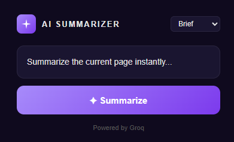

# AI SUMMARIZER

A Chrome extension that summarizes any web page or selected text in a single click, powered by an LLM.

## Features

- **One-click summary** of the current page
- **Select text** to summarize only that portion
- **Brief or Detailed** output mode (3 short bullets vs 5–7 detailed bullets)
- **No API key required from the user** — requests are routed through a Cloudflare Worker proxy that holds the key server-side

## How it works

```
[Extension popup]  →  [Cloudflare Worker proxy]  →  [Groq API]
```

1. The popup grabs the selected text or the page's `innerText` via `chrome.scripting.executeScript`.
2. It sends the text to a Cloudflare Worker proxy.
3. The proxy adds the API key from its environment secrets and forwards the request to Groq (`llama-3.3-70b-versatile`).
4. The bullet-point summary is parsed and rendered as a real `<ul>` in the popup.

## Tech stack

- Chrome Extension Manifest V3
- Vanilla HTML / CSS / JavaScript
- Cloudflare Workers (proxy)
- Groq API (LLM)

## Installation

1. Clone the repo:
   ```
   git clone https://github.com/Thehan05/tl-dr-extension.git
   ```
2. Open Chrome and go to `chrome://extensions`.
3. Enable **Developer mode** (top right).
4. Click **Load unpacked** and select the `tl-dr-extension` folder.
5. The extension icon should appear in your toolbar — click it on any page and hit **Summarize**.

## Setting up your own proxy (optional)

If you want to host your own proxy instead of using mine:

1. Sign up for a free [Cloudflare](https://dash.cloudflare.com/sign-up) account.
2. Install Wrangler: `npm install -g wrangler`
3. Get a free API key from [Groq Console](https://console.groq.com/keys).
4. From the `tldr-proxy` folder:
   ```
   wrangler login
   wrangler secret put GROQ_API_KEY
   npm run deploy
   ```
5. Update the proxy URL in `popup.js` to point at your new Worker.

## Project structure

```
tl-dr-extension/
├── manifest.json     # extension config
├── popup.html        # popup UI
├── popup.css         # styles
├── popup.js          # extension logic
└── icons/            # extension icons
```

## Screenshots

<table>
  <tr>
    <td align="center">
      <br/>
      <em>UI — user can pick Brief or Detailed, then hit Summarize.</em>
    </td>
    <td align="center">
      <br/>
      <em>Summary Result — the page is condensed into clean bullet points.</em>
    </td>
  </tr>
</table>